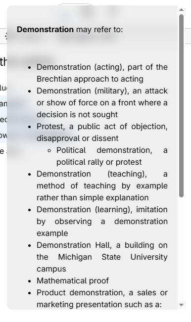

# WikiExt
 
A lightweight Chrome extension that lets you instantly look up Wikipedia summaries for any word or phrase — without ever leaving the page.

<table>
  <tr>
    <td></td>
    <td></td>
  </tr>
</table>

 
## Features
 
- Highlight any text on a webpage, right-click, and select **"Search '...' Definition"**
- A clean overlay card appears with the Wikipedia summary, thumbnail image, and a link to the full article
- Click anywhere outside the card to dismiss it
- Also includes a **popup** accessible from the toolbar icon, which reads the current selection on the active tab

## How It Works
 
1. Select any word or phrase on a webpage
2. Right-click and choose **Search '...' Definition** from the context menu
3. A summary card is fetched from the [Wikipedia REST API](https://en.wikipedia.org/api/rest_v1/) and displayed inline on the page

## Installation
 
1. Clone or download this repository
2. Open Chrome and go to `chrome://extensions/`
3. Enable **Developer mode** (top right)
4. Click **Load unpacked** and select the project folder
